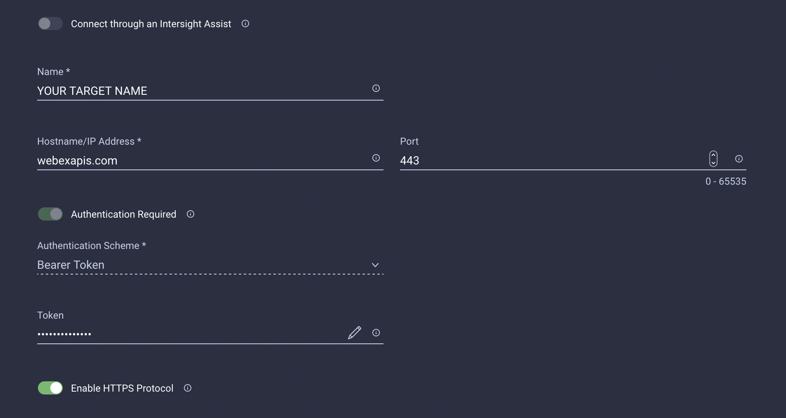
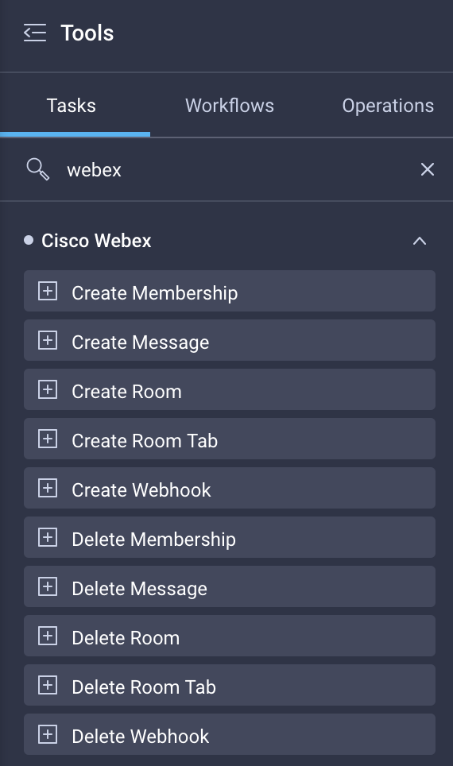
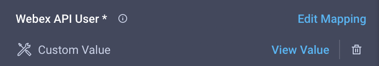

# Intersight Cloud Orchestrator - Webex

## Use Case
Multiple Webex API interactions for managing Rooms, Memberships, Messages, and Webhooks

## Overview
This repository includes the following tasks:
<table>
  <tr>
    <th>Object</th>
    <th>Operation</th>
    <th>Maintainer</th>
    <th>Status</th>
    <th>Link</th>
  </tr>
  
  <!-- Membership -->
  <tr>
    <td rowspan="2">Membership</td>
    <td>Create</td>
    <td><a href="https://github.com/3191110276">Michael Maurer</a></td>
    <td>:white_check_mark: Implemented</td>
    <td><a href="./tasks/CreateMembership.json">Link</a></td>
  </tr>
  <tr>
    <td>Delete</td>
    <td><a href="https://github.com/3191110276">Michael Maurer</a></td>
    <td>:white_check_mark: Implemented</td>
    <td><a href="./tasks/DeleteMembership.json">Link</a></td>
  </tr>
  
  <!-- Message -->
  <tr>
    <td rowspan="2">Message</td>
    <td>Create</td>
    <td><a href="https://github.com/3191110276">Michael Maurer</a></td>
    <td>:white_check_mark: Implemented</td>
    <td><a href="./tasks/CreateMessage.json">Link</a></td>
  </tr>
  <tr>
    <td>Delete</td>
    <td><a href="https://github.com/3191110276">Michael Maurer</a></td>
    <td>:white_check_mark: Implemented</td>
    <td><a href="./tasks/DeleteMessage.json">Link</a></td>
  </tr>
  
  <!-- Room -->
  <tr>
    <td rowspan="2">Room</td>
    <td>Create</td>
    <td><a href="https://github.com/3191110276">Michael Maurer</a></td>
    <td>:white_check_mark: Implemented</td>
    <td><a href="./tasks/CreateRoom.json">Link</a></td>
  </tr>
  <tr>
    <td>Delete</td>
    <td><a href="https://github.com/3191110276">Michael Maurer</a></td>
    <td>:white_check_mark: Implemented</td>
    <td><a href="./tasks/DeleteRoom.json">Link</a></td>
  </tr>
  
  <!-- Webhook -->
  <tr>
    <td rowspan="2">Webhook</td>
    <td>Create</td>
    <td><a href="https://github.com/3191110276">Michael Maurer</a></td>
    <td>:white_check_mark: Implemented</td>
    <td><a href="./tasks/CreateWebhook.json">Link</a></td>
  </tr>
  <tr>
    <td>Delete</td>
    <td><a href="https://github.com/3191110276">Michael Maurer</a></td>
    <td>:white_check_mark: Implemented</td>
    <td><a href="./tasks/DeleteWebhook.json">Link</a></td>
  </tr>
</table>

## Prerequisites
You will need to provide a way to authenticate with the Webex API - either using your own account or using a Bot.

## Claimed Targets
To enable the tasks, you will need to claim an "HTTP Endpoint" Target in Intersight with your personal credentials.
 

## Notes
After importing the tasks you can find them in the Webex category:

To use these tasks, you need to specify the target:
 

Reference for the Webex API: [developer.webex.com](https://developer.webex.com)

